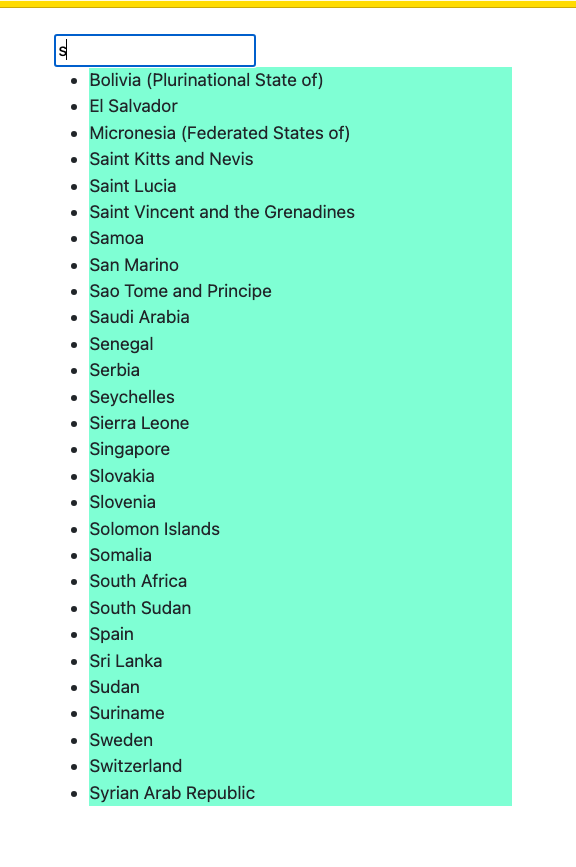
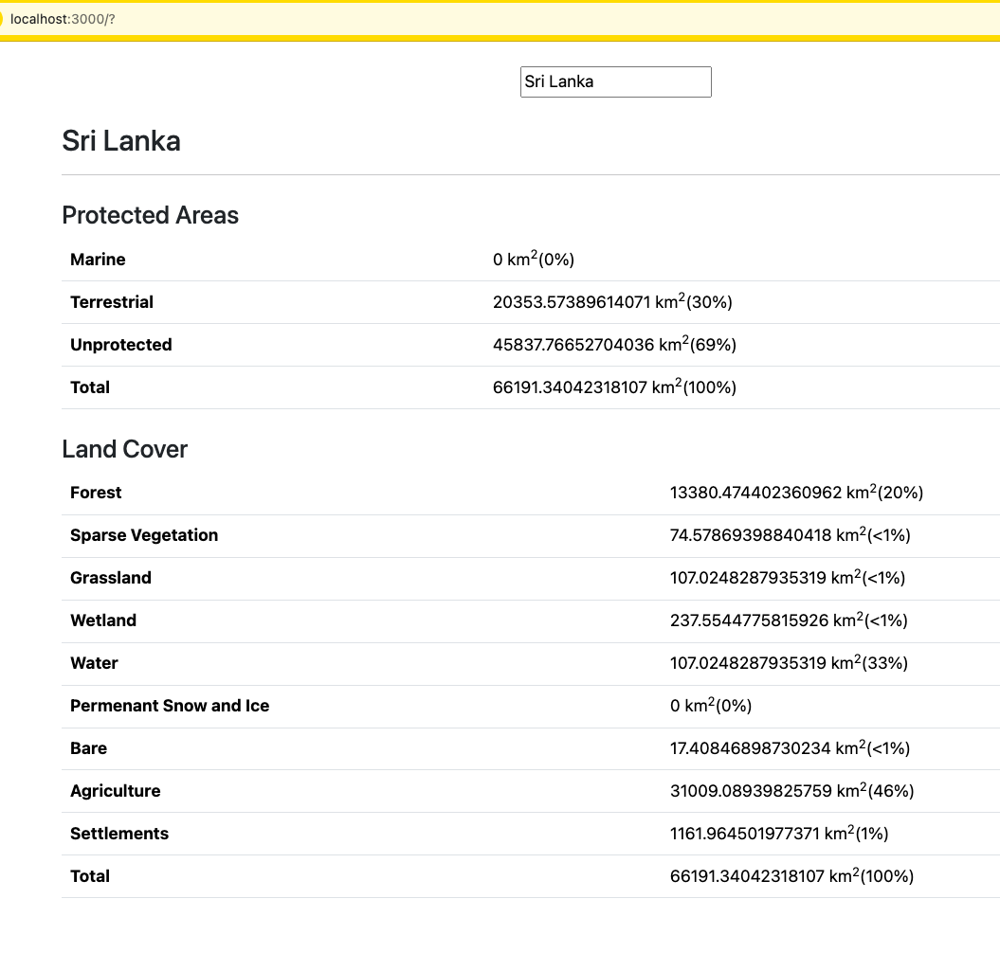

# WCMC Full Stack JS Technical Test

## Setup Guide

- Copy the country-metrics.json file into the root directory of the project
- Install Docker Desktop
- `cd wcmc-fullstack-js-tech-test`
- `cp .example-env .env`
- `cd express-app && cp .example-env .env`
- `docker compose build`
- `docker compose up -d`

### Start express-app

- `docker exec -it app sh` to login to the docker container
- `cd express-app`
- `npm run start`

### Start react-app

- `docker exec -it app sh` to login to the docker container
- `cd react-app`
- `npm run start`

## Activity 3

Due to time constraints I was not able to design db and load it to a database. But the summary of the DB design is here.

### Tables

- users (For access control)

  - id
  - name
  - email
  - encrypted_password
  - role

- countries

  - id  
  - name

- metrics

  - id
  - metric_name
  - country_id

- metric_data
  
  - id
  - metric_id
  - key
  - value
  - unit

### Routes to edit dataset

- `PUT /api/metrics/{id}`
- `DELETE /api/metrics/{id}`
- `PUT /api/metrics/data/{id}`
- `DELETE /api/metrics/data/{id}`

### Screenshots

### Notes

- I have created seperate branches for each completed activity.
  - features/activity-1.1
  - features/activity-1.2
  - features/activity-1.3
  - features/activity-1.4
  - features/activity-2.1
  - features/activity-2.2
  - features/activity-2.3

  I followed standard Github Issues procedure to work on each activity.
  